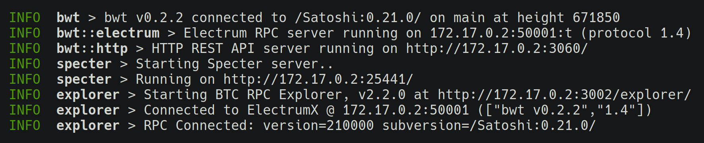

## 💻 Connecting locally

On Linux, you can access the services from the same machine running eznode by connecting directly to the docker container virtual IP address, which will be shown on startup.

[](../src/assets/img/server-urls.png)

You can optionally create an `ez` hostname alias for easier access to the services (for example http://ez:3002/) by mounting your hosts file with `-v /etc/hosts:/ez/hosts`. A new entry with the virtual IP address will be added automatically. You can also do this manually:

```bash
echo "$(docker inspect -f '{{.NetworkSettings.IPAddress}}' ez) ez" | sudo tee -a /etc/hosts
```

On macOS/Windows, you'll have to publish the ports with `-p 127.0.0.1:<port>:<port>` to make them available through `localhost`. Accessing them through the virtual IP address will [not](https://docs.docker.com/docker-for-mac/networking/#known-limitations-use-cases-and-workarounds) [work](https://docs.docker.com/docker-for-windows/networking/#known-limitations-use-cases-and-workarounds). For example, to make the block explorer available at http://localhost:3002/, use:

```bash
docker run -it -p 127.0.0.1:3002:3002 --rm --name ez -v ~/eznode:/data eznode/eznode
```

The ports are: `8332` for the Bitcoin Core RPC, `50001` for the BWT Electrum server, `3060` for the HTTP API, `3002` for the block explorer and `25441` for Specter. They are unencrypted and not suitable for direct access over the internet.

### Local LAN

To access the services within a secure LAN, publish the ports on `0.0.0.0` or leave the address unspecified (e.g. `-p 3002:3002`). Note that this will bind on all available interfaces and [go right over](https://github.com/docker/for-linux/issues/777) some software firewalls.

Depending on how secure you consider your LAN to be, you might want to consider enabling [authentication](accessing#authentication) and/or encryption with SSH/SSL.

## 🌐 Connecting remotely

You can access your eznode remotely using Tor onion services, SSH port tunneling, or SSL. Below is a summary of the pros of cons for each approach.

* Tor onion is the easiest to setup on the server's side, because it works behind NATs and firewalls with no special configuration. It provides strong encryption and authentication.

  However, it requires using the Tor client on your end devices (like Orbot for Android) and connecting through the Tor network, which can be quirky at times. The `TOR_NONANONYMOUS` option may somewhat un-quirk it.

  Set `TOR=1` to enable. See [more details and options here](transports#tor-onion).

* SSH port tunneling can provide strong encryption and authentication using a direct connection to your server. It is the most reliable and the recommended option.

  However, if your server is behind a router or a NAT, you'll need to configure port forwarding so it can accept incoming connections, or use the [assistance of another server that can](transports#punch-through-nats-with-a-reverse-ssh-tunnel). You'll also need an SSH client on your end devices (like ConnectBot for Android). The setup is somewhat more involved compared to Tor.

  Set `SSHD=1` to enable. See [more details and options here](transports#dropbear-ssh).

* SSL relies on centralized authorities and is the least secure option. It also does not natively provide authentication, making it _unsuitable_ for accessing the (unauthenticated) Electrum server. It can be suitable for the bwt/specter/explorer web servers if [`AUTH_TOKEN`](accessing#authentication) is enabled.

  On the plus side, SSL works on nearly all end devices with no special software or configuration. But it still requires setting up port forwarding on the server.

  Set `SSL=1` to enable with a self-signed cert, add `SSL_DOMAIN=mydomain.com` to obtain a LetsEncrypt certificate. See [more details and options here](transports#nginx-ssl).

If you're connecting directly to your server's IP address (i.e. not via onion or a [reverse SSH tunnel](transports#punch-through-nats-with-a-reverse-ssh-tunnel)) and don't have a static IP address, you can consider using a dynamic DNS service like [afraid.org](https://freedns.afraid.org/).

## 🔑 Authentication

You can set `AUTH_TOKEN=mySecretPassword` to enable password authentication for everything _except_ the Electrum server - BWT's HTTP API, BTC RPC Explorer and Specter.

> ⚠️ Using the Electrum server securely over the internet requires an authentication layer like [SSH](transports#dropbear-ssh) or [Tor](transports#tor-onion). An attacker with access to your Electrum server could check whether certain addresses are associated with your wallet, by querying for their history and checking if the server knows about them or not.

If you're only accessing eznode locally or if you're using an authentication layer like Tor or SSH, enabling the password may not be necessary.

When the NGINX-backed SSL is enabled, NGINX will be configured to authenticate the password before forwarding traffic to the backend web services. This helps protect them against exploitation of security vulnerabilities.

You can use any username to login, except for the NGINX-based authentication which expects `satoshi`.


<div class="docs-nav">

[← ⭐ Getting started](getting-started)

[🎁 Packages →](packages)

</div>