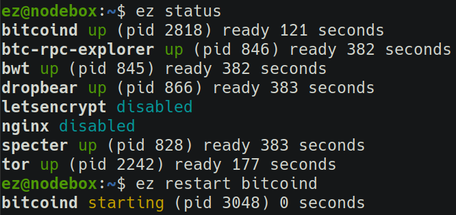
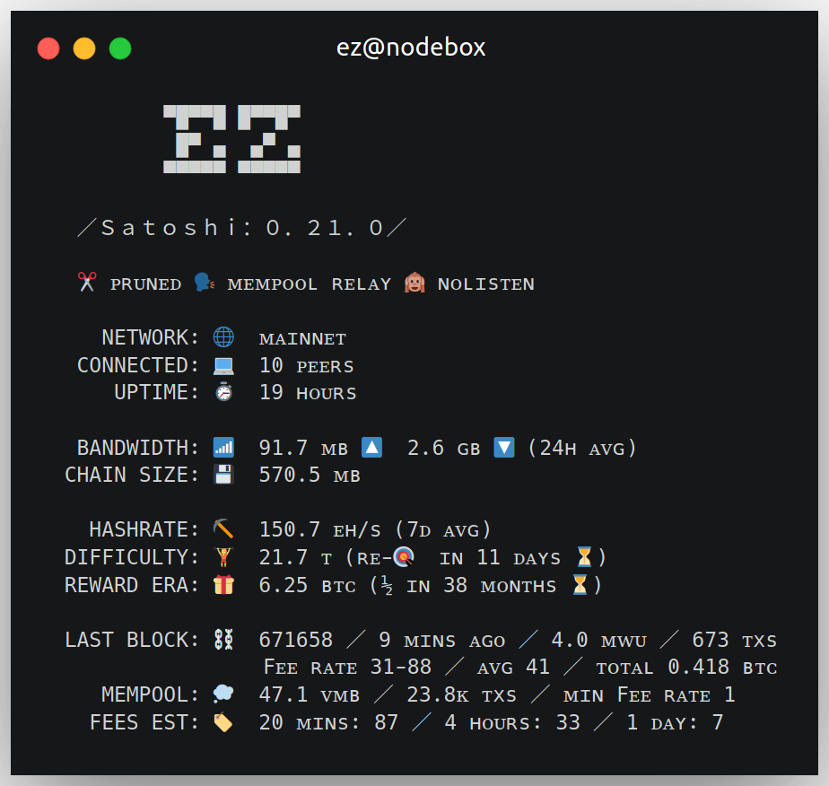

To make things easier, setting the following aliases is recommended:

```bash
alias ez='docker exec ez'
alias bitcoin-cli='ez bitcoin-cli'
```

With these in place, you can use `bitcoin-cli` as you normally would and `ez <cmd>` to issue other commands on the container.

You can add the aliases to `~/.profile` to make them permanent. The instructions below assumes you have them set up.

To run an interactive command, use `docker exec` with `-it`. For example, `docker exec -it ez bash` to start a new shell.

To manage the server remotely, you can enable the [SSH service](transports#dropbear-ssh) with `SSHD=UNRESTRICTED`.

## 😈 Daemonizing

To run the docker container as a background daemon and have it automatically run on start-up, change `docker run` to use `-d --restart unless-stopped` instead of  `-it --rm`. For example:

```bash
docker run -d --restart unless-stopped --name ez -v ~/eznode:/data eznode/eznode
```

You can control the background container using `docker stop|start|restart ez`.

## 🕹️ Controlling services

eznode uses the (fantastic!) [`s6`](https://skarnet.org/software/s6/) init/supervision system (via [`s6-overlay`](https://github.com/just-containers/s6-overlay)) to manage services.

A [CLI utility](https://github.com/ez-org/eznode/blob/master/s6/service) wrapper written on top of the `s6` commands is provided to ease service management:

```bash
# Display an overview of all services
ez status

# Display more information
ez status -v

# Display the status of some service(s)
ez status <services...>

# Service management
ez start|stop|restart <services...>
```



## 🖥️ Terminal display

You can setup a live textual terminal display with information about your node and the Bitcoin network using `watch -t -n10 docker exec ez banner`.

It will look something like this:



## 📝 Viewing logs

The main logs are displayed in the `docker run` output, including some select important log messages across all services. If you're running the container in the background, you can use `docker logs -f ez` to view them.

`ez logs` will stream full logs from all the services (`tail -f`-like). You can use `ez logs <services...>` to select specific services.

`-n` sets how many last log lines are returned initially (defaults to 8). `-c` reads the logs without following them. For example: `ez logs -c -n1000 bitcoind`.

You can request that some services will be logged in the main `docker run` output using the following flags: `BITCOIND_LOGS`, `BWT_LOGS`, `EXPLORER_LOGS`, `SPECTER_LOGS`, `TOR_LOGS`, `SSHD_LOGS` and `LETSENCRYPT_LOGS`.

## 🔄 Updating

To update your ezonde, run:

```bash
docker pull eznode/eznode
```

And re-start the `docker run` command.

## 💾 Backing up

All of the important directories that needs to be backed up are symlinked in `/important`. You can create a backup `tar.gz` file with everything using the following command:

```bash
ez backup > ez-backup.tar.gz
```

The backup includes the following:

* Bitcoin Core wallets (`/data/bitcoin/**/wallets`) + `bitcoin.conf`
* Specter wallets/devices config (`/data/specter`)
* SSH keys (`/data/ssh-keys`)
* SSL keys/certificates (`/data/nginx-keys`)
* Tor onion service files (`/data/tor-hsv`)
* Config file (`/data/config`)

Everything that needs to be backed up is kept within the directory mounted to `/data`, so keeping a safe copy of it is sufficient. But `/data` also includes files that don't require a backup, like the bitcoind data files. The `/important` directory contains the minimal set of files that do require it.

<div class="docs-nav">

[← 🛡️ Secure transports](transports)

[🔏 Signed images →](signed-images)

</div>