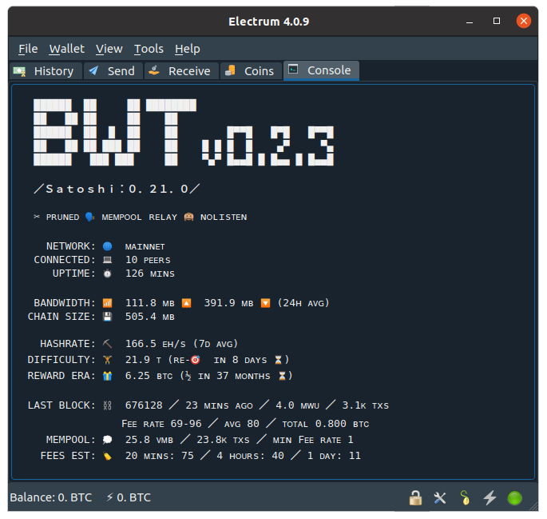
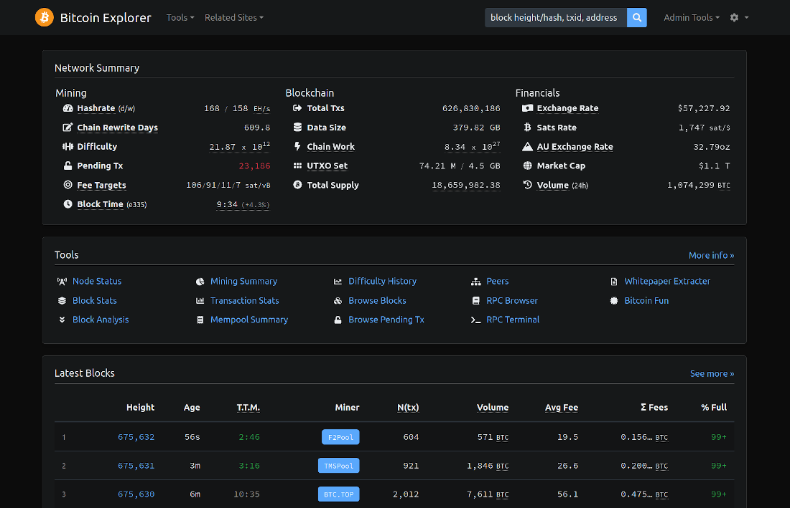
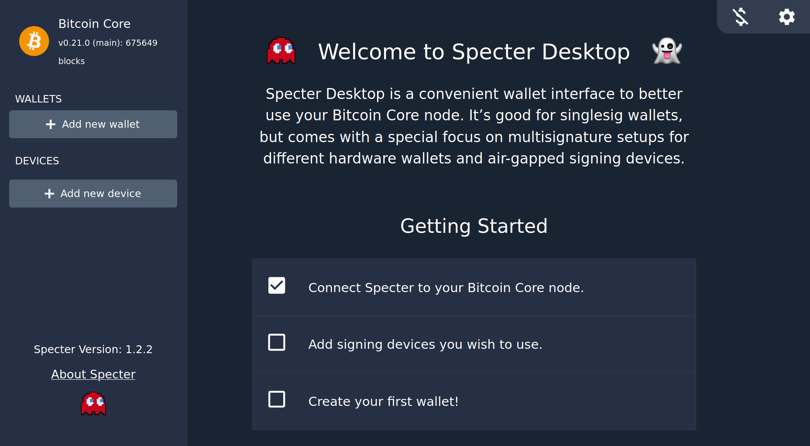

## ₿ Bitcoin Core

Full bitcoin node. [Pruned](getting-started#pruning) by default.

Enabled unless an [external full node](packages#using-existing-full-node) is configured.

#### Fast sync

To enable fast-sync, set `TRUSTED_FASTSYNC=1`. This will download a recent pruned datadir snapshot from [prunednode.today](https://prunednode.today/) and start syncing from that instead of from scratch.

[](../src/assets/img/bitcoin-fastsync.gif)

This can get your node synced up 5-60 minutes, but requires ⚠ **trusting** the distributor of the snapshot. A malicious distributor could _feed you with invalid chain history and lead you to accept fake coins_. Please consider waiting some more for a full sync to avoid taking this risk.

A fast-synced node [is not able](getting-started#pruning) to scan for historical wallet transactions and can therefore only be used with newly created wallets.

[prunednode.today](https://prunednode.today/) is maintained by the [Specter Desktop](https://github.com/cryptoadvance/specter-desktop) team and signed by [Stepan Snigirev](https://stepansnigirev.com/).

> You'll need 10G of free space during the setup to store both the snapshot `.zip` file and the files extracted from it. It will shrink down to <5GB when the process completes.

#### Using existing full node

<details>
<summary>Expand instructions...</summary>

If you already have a Bitcoin Core instance running on the same machine, you can connect eznode to it using cookie authentication by mounting the datadir into `/bitcoin`:

```bash
docker run -v ~/.bitcoin:/bitcoin:ro -it ... eznode/eznode
```

> On Linux, you'll also need to add `--add-host host.docker.internal:host-gateway` to make the host's address discoverable from within the container. On Windows, change `~/.bitcoin` to `$env:AppData\Bitcoin`.

Instructions for modifying bitcoind's `rpcbind`/`rpcallowip` config will be shown on startup. If you're running into trouble with Docker's virtual networking, you can try with [`--net host`](https://docs.docker.com/network/host/) (this should ideally be avoided).

If your node is running remotely, you can configure its URL and RPC credentials with `BITCOIND_URL=http://my-bitcoind-server:8332/ BITCOIND_AUTH=satoshi:mySecretPassword`.

</details>

#### Accessing managed full node

<details>
<summary>Expand instructions...</summary>

To issue RPC commands against eznode's managed Bitcoin Core instance, use `docker exec ez bitcoin-cli <command>` (see [_Node management_](node-management)) or the web RPC console available in BTC RPC Explorer ([public demo](https://explorer.btc21.org/rpc-browser?method=getblockheader)).

To connect to the Bitcoin Core RPC from your host, set `BITCOIND_RPC_ACCESS=<user:pwd>` to open the RPC server for external access using password-based authentication.

On macOS/Windows, you'll also need to publish the RPC port with `-p 127.0.0.1:8332:8332` to make it available through `localhost`. On Linux you can access it directly through the container's IP address or using the `ez` alias (see [_Connecting Locally_](accessing#connecting-locally)).

If you'd like to access the RPC remotely, set `BITCOIND_RPC_ONION` to expose it through an [onion service](transports#tor-onion) or setup an [SSH tunnel](transports#dropbear-ssh).

</details>

#### Options for managed full node

* `PRUNE=550` (prune size, set to `0` to disable pruning)
* `PRUNE_UNTIL=<off>` (keep blocks after the given height/date)
* `TXINDEX=0` (enable txindex, requires pruning to be disabled)
* `BITCOIND_LISTEN=0` (accept incoming connections on the bitcoin p2p network)
* `BITCOIND_TOR=0` (connect to the bitcoin network through tor)
* `BITCOIND_RPC_ACCESS` (expose the bitcoind rpc with password-based auth)
* `BITCOIND_RPC_ONION=0` (expose the bitcoind rpc over onion)
* `BITCOIND_OPTS=<none>` (custom cli options for bitcoind)
* `BITCOIND_LOGS=0` (display bitcoind's logs in the `docker run` output)

A config file may also be provided at `/data/bitcoin/bitcoin.conf`, but the options above will take priority over it.

#### Options for fast-sync

* `TRUSTED_FASTSYNC=0` (enable fast-sync)
* `FASTSYNC_PARALLEL=N` (download using `N` parallel connections)

#### Paths

* `/bitcoin` (mount the bitcoind datadir from the host to enable cookie authentication)
* `/data/bitcoin` (managed bitcoind data directory)

#### Ports

* `8332`/`18332`/`38332`/`18443` (RPC)
* `8333`/`18333`/`38333`/`18444` (P2P)<br>
  (mainnet/testnet/signet/regtest)

## 🔍 Bitcoin Wallet Tracker

[Bitcoin Wallet Tracker](https://bwt.dev/) is a personal wallet tracker that watches your wallet's activity, available as an Electrum RPC server and a descriptor-based [HTTP API](https://github.com/bwt-dev/bwt#http-api). It works similarly to EPS.

BWT keeps an index of your wallet transactions only. To make your wallet activity available, you'll need to [configure](getting-started#configuration) your `XPUB`s/`DESCRIPTOR`s (use `XPUB_*`/`DESC_*` if you have multiple, e.g. `XPUB_1` or `DESC_CHANGE`).

With pruning enabled (the default), starting with a new wallet is the easiest.
A new wallet is also recommended for privacy reasons if your addresses were previously exposed to public Electrum servers.
To use an existing wallet, refer to the [instructions here](getting-started#pruning).

[](../src/assets/img/bwt-electrum.png)

#### Electurm wallet setup

<details>
<summary>Expand instructions...</summary>

If you're creating a new wallet, make sure you don't connect to public servers while doing it to avoid exposing your addresses. You can start Electrum with `--offline` to ensure that.

Grab your xpub from `Wallet` > `Information` and add it to your config file (`~/eznode/config`) as a new line with `XPUB=<my-xpub>`.

Restart eznode, wait for BWT to start up and run `electrum $(docker exec ez electrum-args)` to start Electrum and connect it with your local node. Or you can do this manually:

    electrum --oneserver --server ez:50001:t --skipmerklecheck

> If you don't have the [`ez` hostname](accessing#connecting-locally) set up, replace `ez` with the IP address shown on startup (`electrum-args` does this automatically). The [`skipmerklecheck`](https://github.com/spesmilo/electrum/pull/4957) option is needed to support pruning.

To configure Electrum to use eznode by default, run `docker exec ez electrum-cfg | bash -x`. This will issue `electrum setconfig` commands (you can run without `| bash` to see them).

If you're connecting remotely, you'll need to setup [Tor Onion or an SSH tunnel](accessing#connecting-remotely) for secure access.
</details>

#### Electrum wallet setup - with the BWT plugin

<details>
<summary>Expand instructions...</summary>

Alternatively, you can also setup Electrum desktop to connect with eznode using the [BWT Electrum plugin](https://github.com/bwt-dev/bwt-electrum-plugin).
The plugin will run a separate BWT instance that connects directly to Bitcoin Core and automatically detects your wallet(s) xpub(s).

[Open RPC access](packages#accessing-managed-full-node) to Bitcoin Core by setting `BITCOIND_RPC_ACCESS=<user:pwd>`, then follow the [instructions here](https://github.com/bwt-dev/bwt-electrum-plugin#installation) to setup the plugin.

</details>

#### Options

* `BWT=1` (enabled by default, set to `0` to turn off)
* `XPUB`/`XPUB_*` (xpubs/ypubs/zpubs to track)
* `DESCRIPTOR`/`DESCRIPTOR_*`/`DESC_*` (script descriptors to track)
* `RESCAN_SINCE=now` (date to begin rescanning for historical wallet transactions in `YYYY-MM-DD` format. rescan is disabled by default.)
* `BITCOIND_WALLET=ez-bwt` (bitcoind wallet to use)
* `GAP_LIMIT=300` (the [gap limit](https://github.com/bwt-dev/bwt#gap-limit) for tracking derived addresses)
* `FORCE_RESCAN=0` (force rescanning for historical transactions, even if the addresses were already previously imported)
* `HTTP_CORS=<none>` (allowed cross-origins for the http api server)
* `WEBHOOK_URLS=<none>` (URLs to notify with real-time wallet events)
* `AUTH_TOKEN=<none>` (enable authentication with the specified token)
* `BWT_LOGS=1` (display bwt's logs in the `docker run` output)

The full list of BWT's config options is [available here](https://github.com/bwt-dev/libbwt#config-options).

#### Ports

* `50001` (Electrum RPC)
* `3060` (HTTP API)

#### Paths

* `/data/track-addresses.txt` (optional file with standalone addresses to track)

## 🗺️ BTC RPC Explorer

[BTC RPC Explorer](https://github.com/janoside/btc-rpc-explorer) is a [block explorer](https://explorer.btc21.org/) and node dashboard with an [RPC console](https://explorer.btc21.org/rpc-browser?method=getblockheader), [statistics and graphs](https://explorer.btc21.org/block-stats), [status page](https://explorer.btc21.org/node-status), [peers overview](https://explorer.btc21.org/peers) and more.

[](../src/assets/img/btc-rpc-explorer.png)

Enabled by default, can be [accessed](accessing) using a web browser (e.g. http://ez:3002 if the [`ez` host alias](accessing#connecting-locally) is setup).

Automatically connects with the BWT Electrum server, to enable exploration of your wallet addresses (but not of arbitrary addresses).

#### Pruning support

<details>
<summary>Expand...</summary>

When pruning is enabled or if `txindex` is disabled (the default), some functionality will be limited:

* You will only be able to search for wallet, mempool and recently confirmed transactions by their `txid`.<br>
  Searching for non-wallet transactions that were confirmed over 3 blocks ago is only possible if you provide the confirmed block height in addition to the `txid`, using `<txid>@<height>` in the search box.
* Pruned blocks will display basic header information, without the list of transactions. Transactions in pruned blocks will not be available, unless they're wallet-related.
* The address and amount of previous transaction outputs will not be shown, only the `txid:vout`.
* Mining fees will only be shown for unconfirmed transactions.

To enable full block explorer functionality, set `PRUNE=0 TXINDEX=1`.
</details>

#### Options

* `EXPLORER=1` (enabled by default, set to `0` to turn off)
* `EXPLORER_LOGS=0`  (display btc-rpc-explorer's logs in the `docker run` output)
* `AUTH_TOKEN=<none>` (alias for `BTCEXP_BASIC_AUTH_PASSWORD`)

Plus all of [btc-rpc-explorer's options](https://github.com/janoside/btc-rpc-explorer/blob/master/.env-sample).

#### Ports

* `3002`

## 👻 Specter Desktop

[Specter Desktop](https://github.com/cryptoadvance/specter-desktop) is a wallet GUI for Bitcoin Core with a focus on hardware and multi-sig setups.

[](../src/assets/img/specter-desktop.png)

Set `SPECTER=1` to enable and [access](accessing) using a web browser (e.g. http://ez:25441 if the [`ez` host alias](accessing#connecting-locally) is setup).
For your security, using a separate browser profile without extensions is *highly* recommended.

Using Specter with USB hardware wallets requires [setting up udev rules](https://github.com/cryptoadvance/specter-desktop/tree/master/udev#udev-rules) on the host and starting docker with [`--device /dev/<usb-device-id>`](https://docs.docker.com/engine/reference/commandline/run/#add-host-device-to-container---device). If you're unsure what the device id is, you could also (less ideally) use [`--privileged -v /dev:/dev`](https://docs.docker.com/engine/reference/run/#runtime-privilege-and-linux-capabilities) to give the container full access to all host devices.


#### Options

* `SPECTER=0` (disabled by default, set to `1` to enable)
* `SPECTER_LOGS=0` (display spectr's logs in the `docker run` output)
* `AUTH_TOKEN=<none>` (sets the password for the admin account)

Additional configuration options are available through Specter's web interface.

#### Paths

* `/data/specter` (wallets, devices and other configuration)

#### Ports

* `25441`

<div class="docs-nav">

[← 👩‍💻 Accessing the services](accessing)

[🛡️ Secure transports →](transports)

</div>