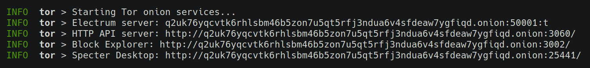
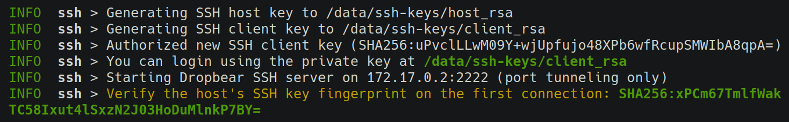

## 🧅 Tor Onion

Tor anonymity network. For secure remote access using onion services and (optionally) for proxying bitcoind.

Onion services provide strong encryption and mutual authentication established based on information embedded into the `.onion` hostname. It does not require setting up port forwarding.

The onion service files, including secret key material, will be kept in `/data/tor-hsv`. If you lose them you'll lose your `.onion` address.

#### Setting up

Start with `TOR=1`. The `.onion` hostname will be shown on startup.

[](../src/assets/img/tor.png)

You'll be able to access your server through the `.onion` address from any client device with Tor installed, like the [Tor Browser](https://www.torproject.org/download/) for desktop or [Orbot](https://play.google.com/store/apps/details?id=org.torproject.android) for Android.


#### Non-anonymous mode

You can set `TOR_NONANONYMOUS=1` to use the [single-hop non-anonymous mode](https://2019.www.torproject.org/docs/tor-manual.html.en#HiddenServiceSingleHopMode). This will remove the 3 extra hops that protect the server's anonymity, making the connection faster and more reliable. Clients will remain anonymous. Note that this is [incompatible](https://gitlab.torproject.org/legacy/trac/-/issues/21284) with `BITCOIND_TOR`.

#### Options
- `TOR=0` (disabled by default, set to `1` to enable)
- `TOR_NONANONYMOUS=0` (enable non-anonymous mode)
- `TOR_CONFIG=<none>` (custom config to append to `torrc`)
- `TOR_LOGS=0` (display tor's logs in the `docker run` output)
- `BITCOIND_TOR=0` (connect to the bitcoin network through tor)
- `BITCOIND_RPC_ONION=0` (expose the bitcoind rpc port over onion)

#### Paths
- `/data/tor-hsv` (onion service files)

## 🐻 Dropbear SSH

Lightweight SSH server powered by [Dropbear](https://matt.ucc.asn.au/dropbear/dropbear.html). For secure remote access via SSH tunnels, using public-key based authentication.

A pair of client and server keys will be generated for you by default. The client's private key that can be used to login will be available in `/data/ssh-keys/client_rsa`.

If you already have a client key that you'd like to use, you can mount the pubkey file into `/root/id.pub` (e.g. `-v ~/.ssh/id_rsa.pub:/root/id.pub`), or mount an `authorized_keys` file into `/root/.ssh/authorized_keys`.

By default, the SSH server permits port tunneling only. Set `SSHD=UNRESTRICTED` to enable shell access, X11 forwarding, agent forwarding and remote port forwarding.


#### Server set-up

Enable `SSHD`, publish the SSH port (2222) for remote access and give the container an hostname (to make its virtual IP address easily discoverable from the client).

```bash
(server)$ docker run -p 2222:2222 --hostname ez -it ... eznode/eznode SSHD=1
```

[](../src/assets/img/ssh.png)

#### Client set-up

Copy the generated client key file from `~/eznode/ssh-keys/client_rsa` on the server to the client machine and setup an SSH tunnel:

```bash
(client)$ ssh -i ./client_rsa -fTN -L 50001:ez:50001 -p 2222 root@mynode.com
```

You will now be able to access the remote Electrum server through `localhost:50001` on the client.

> Protip: Use [`autossh`](https://medium.com/@gary4est/autossh-port-forwarding-23088d948787) to automatically restart dropped connections.

#### Android setup with ConnectBot

<details>
 <summary>Expand instructions...</summary>

You can setup an SSH tunnel from Android using the [ConnectBot](https://connectbot.org/) app. Install it and:

1. Transfer the generated `client_rsa` private key file to your phone, open the app, tap `⋮` > `Manage Pubkeys` > :open_file_folder: and load the key. Long-tap it and select `Load` and `Load on start`.

   > Alternatively, you can generate a key with ConnectBot and transfer the public key file to the server.

2. Go back to the main screen, tap `+` to add a new host, set the address to `root@mynodebox.com:2222`, untick `Start shell session`, tick `Stay connected` and save.

3. Long-tap the host, tap `Edit port forwards`, tap `+`, set `Source port` to the local port to bind on the phone (e.g. `50001`) and `Destination` to `ez:<port>` (e.g. `ez:50001`).

4. Tap the host to connect and verify the host's key fingerprint. Unfortunately, ConnectBot shows it in (the outdated and insecure) MD5, which you can get by setting `WEAK_SSH_CHECKSUM=1`.

You should now be able to access the remote services through `localhost` on your phone.

> ⚠️ Note that any app with the `INTERNET` permission will be able to access the local ports. To prevent malicious apps installed on your device from accessing the services, you'll need to enable authentication. BWT has [experimental support for Electrum authentication](https://github.com/bwt-dev/bwt/blob/master/doc/auth.md) that could be used.

</details>

#### Punch through NATs with a reverse SSH tunnel

If you're unable to directly accept incoming connections to your server, you can create a reverse tunnel to route traffic through a different server that can.

The server can be any cheap VPS. It doesn't need to run anything apart from an SSH server. It won't see anything apart from encrypted traffic and IP addresses. You will be safe from MITM attacks, as long as you verify the fingerprint the first time you connect.

<details>
 <summary>Expand instructions...</summary>

On the cheap VPS, edit `/etc/ssh/sshd_config`, add (assuming your username is `satoshi`):
```
Match User satoshi
  GatewayPorts clientspecified
```

And reload the SSH server (e.g. `service ssh reload`).

Then, on your eznode host, run:
```bash
ssh -fTN -R :2222:localhost:2222 satoshi@cheapvps.com
```

You will now be able to connect to the eznode SSH server through `cheapvps.com:2222`. You can setup SSH tunnels to the services through it in the same manner explained above.

> [localhost.run](https://localhost.run/) offers tunneling as a service for $3.5/month (the free tier isn't suitable because its HTTP-only). It's used with the standard `ssh` client and doesn't require any special software installation. It supports custom domain names.

</details>

#### Options
- `SSHD=0` (disabled by default, set to `1` or `UNRESTRICTED` to enable)
- `SSHD_LOGS=0` (display dropbear's logs in the `docker run` output)
- `DROPBEAR_OPTS=<none>` (custom CLI options for dropbear)

#### Paths
- `/root/id.pub` `/root/.ssh/authorized_keys` (mount from host to use existing client key)
- `/data/ssh-keys/client_rsa` (generated client key)
- `/data/ssh-keys/host_rsa` (generate host key)

#### Ports
- `2222`

## 🔐 NGINX SSL

NGINX-powered SSL terminating reverse proxy.

To setup, set `SSL=1`, publish the SSL port and make sure to enable password-based [authentication](accessing#authentication) for the web services:

```bash
docker run -it -p 443:3443 ... eznode/eznode SSL=1 AUTH_TOKEN=mySecretPassword
```

A private key and a self-signed certificate will be automatically generated and saved to `/data/ssl-keys/selfsigned.{key,cert}`. See [*Let's Encrypt*](#let-s-encrypt) below for a CA-signed cert.

The web services will be available on port `3443` under `/bwt/`, `/explorer/` and `/specter/`.

The *unauthenticated* Electrum SSL server will be available on port `50002`. It should *not* be exposed directly to the Internet and is meant to be used behind an authentication layer like SSH or Tor.

When `AUTH_TOKEN` is set, NGINX will be configured to authenticate the password before forwarding traffic to the backend web services. This helps protect them against exploitation of security vulnerabilities.


#### Options
- `SSL=0` (disabled by default, set to `1` to enable)
- `AUTH_TOKEN=<none>` (setup `htpasswd`-based login enforced by nginx)

#### Paths
- `/data/ssl-keys/selfsigned.{key,cert}` (keys and certificates)

#### Ports
- `3443` (HTTPS)
- `50002` (Electrum RPC)

## 📜 Let's Encrypt

To obtain a CA-signed certificate from Let's Encrypt, set `SSL=1 SSL_DOMAIN=<domain>` and publish the HTTP/S ports for remote access, like so:

```bash
docker run -it -p 443:3443 -p 80:8080 ... eznode/eznode SSL=1 SSL_DOMAIN=mynodebox.com
```

#### With existing webserver

<details>
 <summary>Expand instructions...</summary>

Verifying domain ownership for the Let's Encrypt certificate requires accepting connections on port `80`. If you already have a webserver occupying this port, you can configure it to forward verification requests on a subdomain to the ez webserver. Example with NGINX:

```
server {
    listen 80;
    server_name ez.mynodebox.com;
    location /.well-known/acme-challenge/ { proxy_pass http://localhost:8080; }
}
```

Then start docker with `-p 3443:3443 -p 127.0.0.1:8080:8080` and access the SSL server through `https://ez.mynodebox.com:3443/`.
</details>

#### Options
- `SSL_DOMAIN=<none>` (obtain CA-signed certificate for the given domain)
- `LETSENCRYPT_EMAIL=<none>` (for renewal and security notices, optional)
- `LETSENCRYPT_LOGS=0` (display letsencrypt’s logs in the `docker run` output)

#### Paths
- `/data/ssl-keys/letsencrypt` (keys and certificates)

#### Ports
- `8080` (HTTP, for domain verification)

<div class="docs-nav">

[← 🎁 Packages](packages)

[🔧 Node management →](node-management)

</div>